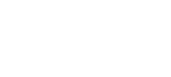
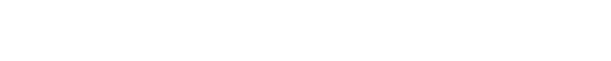

A simple mathematical LaTeX render for python

<!--  -->

## Features

* Paranteser
* Subscript
* Superscript
* Superscript + Subscript
* Symboler
* Fractions
* Cases
* Some greek symbols
* Square root

## To do list

- [ ] Sum
- [ ] Integrals
- [ ] Prettier rendering
- [ ] Better alignment
