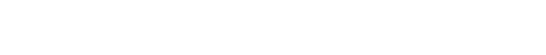

A simple mathematical LaTeX renderer for Python. Output as **PNG** (Pillow) or **SVG** (vector text with New Computer Modern).



## Installation

```bash
pip install fondi
```

Requires Python 3.8+, Pillow, and NumPy.

## Quick start

```python
import fondi

mt = fondi.MathText(r"\frac{1}{2}", fontSize=50, color=(255, 255, 255, 255))

mt.to_pil().save("formula.png")   # raster
mt.save_svg("formula.svg")        # small SVG + external fonts (default)
```

### `MathText` arguments

| Argument | Type | Description |
|----------|------|-------------|
| `text` | `str` | Fondi math string (LaTeX-like, not full LaTeX). |
| `fontSize` | `int` | Nominal size in **pixels** (same scale as the PNG renderer). |
| `color` | `(R, G, B, A)` | Each channel `0–255`. |

### Output methods

| Method | Returns | Use for |
|--------|---------|---------|
| `to_pil()` | `PIL.Image` | Matplotlib, GUIs, notebooks, textures. |
| `to_svg(...)` | `str` | SVG XML; you control where files are written. |
| `save_svg(path, ...)` | `Path` | Write SVG to disk; optional font copy. |
| `scene()` | `Scene` | Inspect layout primitives (advanced). |
| `image` | `PIL.Image` | Same as `to_pil()` (backward compatible). |

---

## SVG export and fonts

Text in SVG uses **New CM10** (`NewCM10-Regular.otf` / `NewCM10-Italic.otf` from the package). Integrals and braces are still **embedded PNGs** inside the SVG (v1).

You choose how those OTF files are shipped:

| Mode | SVG size | Font files | Best for |
|------|----------|------------|----------|
| **Embedded** | Large (~1 MB+) | Inside the SVG | Single file, email, simple hosting |
| **External + copy** | Small (few KB) | Copied next to the SVG | First export in a project |
| **External, no copy** | Small | You provide them | Many SVGs sharing one `fonts/` folder |

### 1. Embedded fonts (self-contained)

Every `to_svg()` call includes both full OTF files as base64 in `<defs>`. No separate font files; viewers need nothing installed.

```python
svg = mt.to_svg()                                    # default
svg = mt.to_svg(embed_fonts=True)

with open("formula.svg", "w") as f:
    f.write(svg)

mt.save_svg("formula.svg", embed_fonts=True)
```

### 2. External fonts (small SVG)

The SVG references OTF files by URL, e.g. `fonts/NewCM10-Regular.otf`. **You must keep those paths valid** relative to where the SVG is opened (browser, Inkscape, etc.).

#### `to_svg()` — string only

```python
svg = mt.to_svg(embed_fonts=False, font_url_prefix="fonts/")
# Writes no font files. You place the OTFs yourself.
```

| Parameter | Default | Meaning |
|-----------|---------|---------|
| `embed_fonts` | `True` | `False` → external `@font-face` URLs. |
| `font_url_prefix` | `""` | Directory prefix in the URL, e.g. `"fonts/"` or `""` if OTFs sit **beside** the SVG. |

Copy fonts once from the package:

```python
from fondi.backends import copy_font_files

copy_font_files("shared/fonts/")
# Creates shared/fonts/NewCM10-Regular.otf and NewCM10-Italic.otf
```

Then export many formulas pointing at the same folder:

```python
for name, tex in formulas.items():
    m = fondi.MathText(tex, 24, (0, 0, 0, 255))
    with open(f"out/{name}.svg", "w") as f:
        f.write(m.to_svg(embed_fonts=False, font_url_prefix="../shared/fonts/"))
```

#### `save_svg()` — write file (+ optional font copy)

```python
mt.save_svg("out/formula.svg")
```

Defaults: `embed_fonts=False`, `font_subdir="fonts"`, `copy_fonts=True`.

| Parameter | Default | Meaning |
|-----------|---------|---------|
| `embed_fonts` | `False` | `True` → one large self-contained SVG. |
| `font_subdir` | `"fonts"` | Subfolder under the SVG’s parent for OTF files and URL prefix (`"fonts/"`). Use `None` for OTFs in the **same directory** as the SVG. |
| `copy_fonts` | `True` | Copy bundled OTFs into `font_subdir`. `False` → **only write the SVG** (fonts must already exist there). |

**Copy fonts once per output tree:**

```python
mt.save_svg("out/formula.svg", embed_fonts=False, font_subdir="fonts")
```

```
out/
  formula.svg
  fonts/
    NewCM10-Regular.otf
    NewCM10-Italic.otf
```

**SVG only (fonts already present):**

```python
from fondi.backends import copy_font_files

copy_font_files("out/fonts/")   # once

for i, tex in enumerate(items):
    fondi.MathText(tex, 20, (0, 0, 0, 255)).save_svg(
        f"out/label_{i}.svg",
        embed_fonts=False,
        font_subdir="fonts",
        copy_fonts=False,
    )
```

**OTFs beside the SVG** (no subfolder):

```python
mt.save_svg("out/formula.svg", embed_fonts=False, font_subdir=None)
# Expects out/NewCM10-Regular.otf next to out/formula.svg
# URLs in SVG: NewCM10-Regular.otf (no prefix)
```

### Choosing a mode (cheat sheet)

```python
# One file, simplest sharing
mt.save_svg("x.svg", embed_fonts=True)

# Project with assets/fonts/ reused everywhere
copy_font_files("assets/fonts/")
mt.save_svg("plots/a.svg", embed_fonts=False, font_subdir="fonts", copy_fonts=False)
# Ensure font_subdir resolves from plots/a.svg → often use font_url_prefix like "../assets/fonts/"
# via to_svg(), or place fonts relative to each SVG accordingly
```

For nested paths, prefer `to_svg(embed_fonts=False, font_url_prefix="...")` with a prefix that matches your real directory layout.

### Low-level API

```python
from fondi.backends import render_svg, save_svg_bundle, copy_font_files

scene = mt.scene()
svg = render_svg(scene, embed_fonts=False, font_url_prefix="fonts/")
save_svg_bundle(scene, "out.svg", embed_fonts=False, font_subdir="fonts", copy_fonts=False)
```

---

## PNG export

Raster output bakes the font into pixels. No font files are needed at view time.

```python
img = mt.to_pil()
img.save("formula.png")
mt.image.save("formula.png")   # equivalent
```

---

## Architecture

Layouts position math and emit a backend-neutral **scene graph** (`TextRun`, `Line`, `RasterSymbol`, …). Renderers turn the same scene into PNG or SVG — new macros are implemented once.

| Layer | Role |
|-------|------|
| `layout/*`, `plain/plain.py` | Geometry + scene primitives only |
| `metrics.py` | Font measurement (single source) |
| `scene.py` | Data types |
| `backends/pillow.py`, `backends/svg.py` | PNG / SVG output |

## Adding a macro (write once)

1. Add `FooLayout(Layout)` under `src/fondi/layout/`.
2. Register `MACROS["\\foo"] = FooLayout`.
3. Position children with `boundingBox`, `setCenter`, etc.
4. Implement `collect_scene(offset)` returning `TextRun`, `Line`, `RasterSymbol`, … — no Pillow or SVG code in the layout.
5. Run `tests/test.py` (PNG) and `tests/test_svg.py` (SVG smoke).

## Features

* Parentheses
* Subscript / superscript
* Symbols (PNG assets in SVG, v1)
* Fractions
* Cases
* Greek letters
* Square root
* Integrals

## Tests

```bash
cd tests && python test.py      # regenerate PNG golden images
cd tests && python test_svg.py  # SVG smoke (embedded + external fonts)
```
